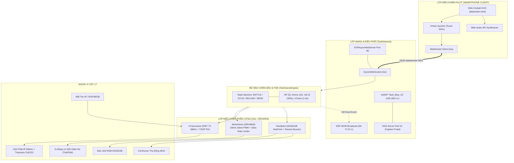
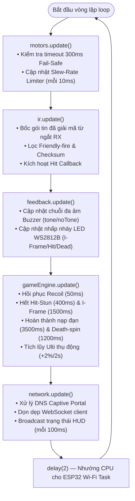
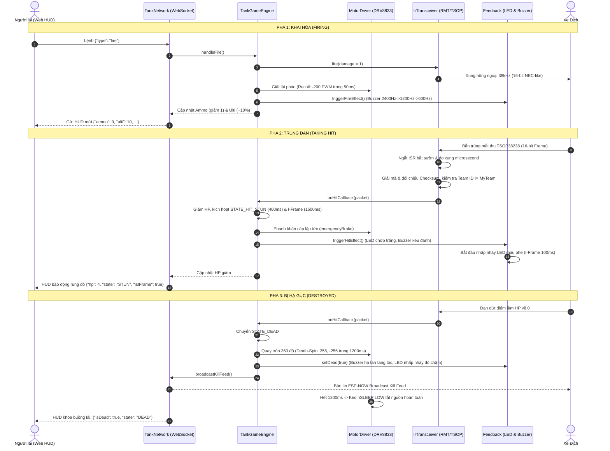

# MICRO TANK ARENA (ESP32-C3 LASER TAG) — BỘ TÀI LIỆU TOÀN DIỆN HỆ THỐNG
## SYSTEM MASTER ARCHITECTURE & SPECIFICATION (SINGLE SOURCE OF TRUTH v1.1.0)

> **MỤC ĐÍCH TÀI LIỆU**: Đây là bản tài liệu tổng thể (Single Source of Truth) tối thượng của toàn bộ dự án **Micro Tank Arena**. Bất kỳ Kỹ sư phần mềm, Kỹ sư nhúng, Kỹ sư phần cứng hoặc Trợ lý AI (Claude, GPT, Gemini, DeepSeek,...) khi đọc tài liệu này đều có thể nắm bắt **100% kiến trúc phần cứng, firmware vi điều khiển, ứng dụng buồng lái Web HUD, giao thức truyền thông, cờ trạng thái game, và toàn bộ luồng hoạt động** mà không cần đọc rà soát lại hàng ngàn dòng mã nguồn từ đầu.  
> **Phiên bản hệ thống**: v1.1.0 (Vá toàn bộ 4 lỗi phần cứng cốt lõi & Tích hợp checklist kiểm tra chéo)  
> **Nền tảng**: PlatformIO / ESP-IDF Arduino Core (`espressif32`) / RISC-V ESP32-C3 Super Mini  
> **Ngày cập nhật**: 2026-09-27  

---

## LỜI NHẮC NGỮ CẢNH DÀNH CHO AI (CONTEXT PRIMING PROMPT)

```text
Bạn đang làm việc trên dự án "Micro Tank Arena" — một hệ thống xe tăng chiến đấu mini điều khiển từ xa kết hợp bắn súng laser tag quang học (Optical IR) thời gian thực trên nền tảng vi điều khiển ESP32-C3 Super Mini (RISC-V 160MHz).

DỰ ÁN BAO GỒM 5 PHÂN HỆ CỐT LÕI:
1. ĐỘNG LỰC (MotorDriver): Mạch cầu H DRV8833 điều khiển 2 bánh xích độc lập qua 4 kênh PWM 2kHz tối ưu mô-men xoắn cho động cơ N20 (GPIO 0, 1, 2, 3) và chân nSLEEP (GPIO 8). Có bộ lọc gia tốc (Slew-Rate Limiter) giới hạn ±20 PWM/10ms chống sụt áp nguồn (Brownout Reset) và cờ tự ngắt Fail-safe 300ms khi mất kết nối.
2. TÁC CHIẾN QUANG HỌC (IrTransceiver & IrProtocol): Bắn tia IR 940nm điều chế sóng mang 38kHz góc hẹp bằng ngoại vi RMT phần cứng (GPIO 4 qua 2N2222). Nhận đạn qua mắt thu TSOP38238 tích cực mức LOW (GPIO 5) với ngắt microsecond giải mã gói tin 16-bit (Team: 4b, Player: 4b, Damage: 4b, Checksum: 4b). Chống phản xạ tường và loại bỏ đạn cùng phe (Friendly Fire Rejection).
3. HIỆU ỨNG PHẢN HỒI (Feedback): 01 đèn LED RGB WS2812B (GPIO 6) báo màu phe, nháy trắng khi dính đạn, chớp nhanh khi bất tử (I-Frame), nháy đỏ khi chết. 01 Còi buzzer thụ động (GPIO 7) tạo âm thanh phát súng, trúng đạn, nạp đạn, còi báo động qua xung PWM tone đa tần non-blocking.
4. MÁY TRẠNG THÁI GAME (TankGameEngine): Finite State Machine quản lý 5 trạng thái (LOBBY, BATTLE, HIT_STUN, RELOAD, DEAD). Máu mặc định 5 HP, băng đạn 10 viên, hồi chiêu bắn 800ms, giật lùi (Recoil) 50ms, khựng bánh xe khi trúng đạn 400ms, bất tử 1500ms, nạp đạn 3500ms, thanh nộ Ulti tích lũy 0-100% (bắn đại bác xuyên giáp dealt 3 DMG).
5. MẠNG CHỦ ĐỘNG HYBRID ALWAYS-ON & QUẢN TRỊ NVS (TankNetwork): Chế độ `WIFI_AP_STA` khởi động siêu tốc trong 200ms — luôn phát SoftAP "Tank_xxxx" (192.168.4.1) ngay lập tức để người chơi vào lái được ngay không độ trễ. Song song đó, tiến trình kết nối Wi-Fi nhà (Router STA) chạy ngầm trong nền. Nếu kết nối Router thành công, xe tự đồng bộ kênh ESP-NOW theo Router và cập nhật IP nhà lên Web HUD nhưng VẪN DUY TRÌ SoftAP song song làm cổng cứu hộ phụ. Nếu mất mạng hoặc ở sân đấu lạ, xe tự động fallback về Standalone (khóa cứng Channel 1). Quản trị mạng chủ động ngay trên Web HUD (huy hiệu mạng trực quan, quét Wi-Fi, lưu NVS, nút bấm Quên Wi-Fi trên web), nút BOOT vật lý (GPIO 9 đè 3s) giữ vai trò cứu hộ phần cứng cuối cùng.

QUY TẮC PHÁT TRIỂN & CHỈNH SỬA (KARPATHY EMBEDDED GUIDELINES):
- Không phỏng đoán pinout: GPIO 8 & GPIO 2 là Strapping Pins (GPIO 8 phải ở mức HIGH lúc boot, GPIO 2 không được kéo LOW lúc boot). GPIO 9 là nút BOOT kiêm Hard Reset NVS (giữ 3s).
- Thay đổi phẫu thuật (Surgical Changes): Chỉ sửa đúng biến cần cấu hình theo bảng tra cứu.
- Brownout Prevention: Tuyệt đối không xóa Slew-Rate Limiter trong MotorDriver.
- Fail-Safe: Xe phải tự dừng trong 300ms nếu mất sóng WebSocket.
```

---

## MỤC LỤC CHI TIẾT

- [MICRO TANK ARENA (ESP32-C3 LASER TAG) — BỘ TÀI LIỆU TOÀN DIỆN HỆ THỐNG](#micro-tank-arena-esp32-c3-laser-tag--bộ-tài-liệu-toàn-diện-hệ-thống)
  - [LỜI NHẮC NGỮ CẢNH DÀNH CHO AI (CONTEXT PRIMING PROMPT)](#lời-nhắc-ngữ-cảnh-dành-cho-ai-context-priming-prompt)
  - [MỤC LỤC CHI TIẾT](#mục-lục-chi-tiết)
  - [1. TỔNG QUAN HỆ SINH THÁI & KIẾN TRÚC HỆ THỐNG](#1-tổng-quan-hệ-sinh-thái--kiến-trúc-hệ-thống)
    - [1.1 Mục đích và chức năng cốt lõi](#11-mục-đích-và-chức-năng-cốt-lõi)
    - [1.2 Sơ đồ khối kiến trúc hệ thống (System Architecture)](#12-sơ-đồ-khối-kiến-trúc-hệ-thống-system-architecture)
    - [1.3 Sơ đồ tuần hoàn thời gian thực (Real-time Non-blocking Loop)](#13-sơ-đồ-tuần-hoàn-thời-gian-thực-real-time-non-blocking-loop)
    - [1.4 Sơ đồ tuần tự tương tác chiến đấu (Battle Sequence Flow)](#14-sơ-đồ-tuần-tự-tương-tác-chiến-đấu-battle-sequence-flow)
  - [2. ĐẶC TẢ PHẦN CỨNG & BẢNG GOLDEN PINOUT](#2-đặc-tả-phần-cứng--bảng-golden-pinout)
    - [2.1 Bảng quy hoạch chân Golden Pinout ESP32-C3 Super Mini](#21-bảng-quy-hoạch-chân-golden-pinout-esp32-c3-super-mini)
    - [2.2 Sơ đồ khối đấu nối điện tử (Hardware Schematics Topology)](#22-sơ-đồ-khối-đấu-nối-điện-tử-hardware-schematics-topology)
    - [2.3 Phân tích an toàn phần cứng & Bảo vệ nguồn điện](#23-phân-tích-an-toàn-phần-cứng--bảo-vệ-nguồn-điện)
  - [3. QUY HOẠCH BỘ NHỚ & PHÂN VÙNG FLASH](#3-quy-hoạch-bộ-nhớ--phân-vùng-flash)
    - [3.1 Bảng phân vùng Flash 4MB (partitions.csv)](#31-bảng-phân-vùng-flash-4mb-partitionscsv)
    - [3.2 Cơ chế phân phối Web Assets: PROGMEM vs LittleFS](#32-cơ-chế-phân-phối-web-assets-progmem-vs-littlefs)
  - [4. GIAO THỨC TRUYỀN THÔNG & ĐẶC TẢ GÓI TIN](#4-giao-thức-truyền-thông--đặc-tả-gói-tin)
    - [4.1 Giao thức quang học IR 16-bit (Optical IR Combat Protocol)](#41-giao-thức-quang-học-ir-16-bit-optical-ir-combat-protocol)
    - [4.2 Giao thức WebSocket điều khiển (Web Client $\leftrightarrow$ Xe)](#42-giao-thức-websocket-điều-khiển-web-client-leftrightarrow-xe)
    - [4.3 Giao thức phát sóng hạ gục ESP-NOW (Kill Feed Mesh)](#43-giao-thức-phát-sóng-hạ-gục-esp-now-kill-feed-mesh)
    - [4.4 Mạng Wi-Fi & Cơ chế Captive Portal Zero-App](#44-mạng-wi-fi--cơ-chế-captive-portal-zero-app)
  - [5. ĐẶC TẢ CÁC MODULE FIRMWARE CHUYÊN SÂU](#5-đặc-tả-các-module-firmware-chuyên-sâu)
    - [5.1 Module Động lực: MotorDriver](#51-module-động-lực-motordriver)
    - [5.2 Module Quang học: IrTransceiver & IrProtocol](#52-module-quang-học-irtransceiver--irprotocol)
    - [5.3 Module Phản hồi: Feedback](#53-module-phản-hồi-feedback)
    - [5.4 Bộ máy trạng thái game: TankGameEngine](#54-bộ-máy-trạng-thái-game-tankgameengine)
    - [5.5 Module Mạng & Điều phối: TankNetwork](#55-module-mạng--điều-phối-tanknetwork)
  - [6. ĐẶC TẢ GIAO DIỆN BUỒNG LÁI WEB (TACTICAL COCKPIT HUD)](#6-đặc-tả-giao-diện-buồng-lái-web-tactical-cockpit-hud)
    - [6.1 Cấu trúc màn hình buồng lái](#61-cấu-trúc-màn-hình-buồng-lái)
    - [6.2 Cơ chế Joystick ảo & Thuật toán chuyển đổi vi sai](#62-cơ-chế-joystick-ảo--thuật-toán-chuyển-đổi-vi-sai)
    - [6.3 Hệ thống âm thanh tổng hợp Web Audio API Synthesizer](#63-hệ-thống-âm-thanh-tổng-hợp-web-audio-api-synthesizer)
    - [6.4 Quy trình cập nhật giao diện 2 bước](#64-quy-trình-cập-nhật-giao-diện-2-bước)
  - [7. QUẢN LÝ NĂNG LƯỢNG, FAIL-SAFE & CƠ CHẾ CỨU HỘ](#7-quản-lý-năng-lượng-fail-safe--cơ-chế-cứu-hộ)
    - [7.1 Bảo vệ sụt áp nguồn (Brownout Prevention)](#71-bảo-vệ-sụt-áp-nguồn-brownout-prevention)
    - [7.2 Cơ chế tự ngắt khi mất kết nối (300ms Fail-Safe)](#72-cơ-chế-tự-ngắt-khi-mất-kết-nối-300ms-fail-safe)
    - [7.3 Tiết kiệm năng lượng qua chân nSLEEP](#73-tiết-kiệm-năng-lượng-qua-chân-nsleep)
    - [7.4 Khóa kênh sóng Wi-Fi Channel 1](#74-khóa-kênh-sóng-wi-fi-channel-1)
  - [8. CẤU TRÚC THƯ MỤC & BẢNG TRA CỨU CHỈNH SỬA NHANH](#8-cấu-trúc-thư-mục--bảng-tra-cứu-chỉnh-sửa-nhanh)
    - [8.1 Cây thư mục dự án hoàn chỉnh](#81-cây-thư-mục-dự-án-hoàn-chỉnh)
    - [8.2 Bảng tra cứu cấp tốc "Yêu cầu $\rightarrow$ File & Dòng cần sửa"](#82-bảng-tra-cứu-cấp-tốc-yêu-cầu-rightarrow-file--dòng-cần-sửa)
  - [9. HƯỚNG DẪN THIẾT LẬP MÔI TRƯỜNG, BUILD & FLASH](#9-hướng-dẫn-thiết-lập-môi-trường-build--flash)
    - [9.1 Yêu cầu môi trường & Công cụ](#91-yêu-cầu-môi-trường--công-cụ)
    - [9.2 Các câu lệnh CLI biên dịch & nạp code PlatformIO](#92-các-câu-lệnh-cli-biên-dịch--nạp-code-platformio)
    - [9.3 Quy trình kiểm tra nghiệm thu định lượng (Acceptance Tests)](#93-quy-trình-kiểm-tra-nghiệm-thu-định-lượng-acceptance-tests)
  - [10. BỘ TIÊU CHÍ KIỂM TRA CHÉO 6 NHÓM (CROSS-CHECK VERIFICATION CHECKLIST)](#10-bộ-tiêu-chí-kiểm-tra-chéo-6-nhóm-cross-check-verification-checklist)
  - [11. BẢNG MÃ LỖI THƯỜNG GẶP & BIỆN PHÁP KHẮC PHỤC CẤP TỐC (TROUBLESHOOTING MATRIX)](#11-bảng-mã-lỗi-thường-gặp--biện-pháp-khắc-phục-cấp-tốc-troubleshooting-matrix)

---

## 1. TỔNG QUAN HỆ SINH THÁI & KIẾN TRÚC HỆ THỐNG

### 1.1 Mục đích và chức năng cốt lõi
**Micro Tank Arena** là hệ thống xe tăng mô hình chiến đấu mini tỉ lệ nhỏ (sử dụng 2 động cơ giảm tốc N20 kéo hai dải xích độc lập), tích hợp công nghệ súng bắn tia hồng ngoại quang học (Laser Tag) và điều khiển không dây thời gian thực qua điện thoại thông minh mà không yêu cầu cài đặt ứng dụng (Zero-App Installation).

Các tính năng đột phá của dự án:
1. **Buồng lái ảo Web HUD (Cockpit):** Người lái chỉ cần kết nối vào mạng Wi-Fi do xe phát ra, điện thoại sẽ tự động mở màn hình điều khiển buồng lái chiến thuật với joystick ảo mượt mà, đồng hồ hiển thị giáp (Armor pips), băng đạn, nộ khí chiêu cuối, âm thanh vòm sci-fi bằng Web Audio API.
2. **Hệ thống tác chiến Laser Tag chính xác:** Sử dụng phát xung hồng ngoại 38kHz góc hội tụ $10^\circ - 15^\circ$, mã hóa gói tin 16-bit kiểm tra Checksum và Team ID để mô phỏng đường đạn chính xác, chống phản xạ tia qua tường và ngăn chặn hoàn toàn việc bắn nhầm đồng đội.
3. **Cơ chế cân bằng vật lý & chiến thuật game:** Mô phỏng độ giật khi khai hỏa (Recoil), hiệu ứng khựng xe khi trúng đạn (Hit-Stun 400ms), thời gian bất tử nhấp nháy đèn (I-Frame 1500ms), cơ chế nạp đạn có thời gian chờ (Reload 3.5s), và chiêu cuối đại bác hạng nặng (Artillery Ulti 3 DMG) tích lũy theo thời gian và sát thương.
4. **Mạng đa chế độ tự hòa nhập:** Tự động phát SoftAP + Captive Portal nếu hoạt động độc lập ngoài trời; hoặc tự kết nối vào Router trung tâm "TankWar_Arena" nếu tham gia giải đấu nhiều xe; kết hợp phát bản tin hạ gục (Kill Feed) liên xe qua giao thức không dây ESP-NOW.

---

### 1.2 Sơ đồ khối kiến trúc hệ thống (System Architecture)



---

### 1.3 Sơ đồ tuần hoàn thời gian thực (Real-time Non-blocking Loop)

Hệ thống được thiết kế theo kiến trúc hợp tác phi chặn (Cooperative Non-blocking Loop). Hàm [loop()](file:///c:/Users/phamn/Documents/PlatformIO/TankMini/src/main.cpp#L62-L73) trong `main.cpp` gọi lần lượt phương thức `.update()` của cả 5 phân hệ với chu kỳ thực thi < 2ms:



---

### 1.4 Sơ đồ tuần tự tương tác chiến đấu (Battle Sequence Flow)



---

## 2. ĐẶC TẢ PHẦN CỨNG & BẢNG GOLDEN PINOUT

### 2.1 Bảng quy hoạch chân Golden Pinout ESP32-C3 Super Mini

Vi điều khiển trung tâm là **ESP32-C3 Super Mini** (kiến trúc RISC-V 32-bit lõi đơn, xung nhịp 160MHz, bộ nhớ SRAM 400KB, Flash 4MB tích hợp). Dưới đây là bảng phân bổ chân độc quyền, tối ưu hóa để triệt tiêu mọi xung đột phần cứng:

| Chân GPIO | Kiểu chân | Ngoại vi ESP32 | Linh kiện kết nối | Chức năng chi tiết | Lý do kỹ thuật & Ràng buộc phần cứng |
| :--- | :--- | :--- | :--- | :--- | :--- |
| **GPIO 0** | Output | LEDC Ch 0 | DRV8833 `IN1` | Động cơ Trái: Tiến (PWM) | Chân thông thường, an toàn khi khởi động. |
| **GPIO 1** | Output | LEDC Ch 1 | DRV8833 `IN2` | Động cơ Trái: Lùi (PWM) | Chân thông thường, an toàn khi khởi động. |
| **GPIO 2** | Output | LEDC Ch 2 | DRV8833 `IN3` | Động cơ Phải: Tiến (PWM) | **[STRAPPING PIN]**: ESP32-C3 yêu cầu GPIO 2 không được kéo LOW từ bên ngoài khi boot. Đầu vào DRV8833 có trở kéo nội phù hợp. |
| **GPIO 3** | Output | LEDC Ch 3 | DRV8833 `IN4` | Động cơ Phải: Lùi (PWM) | Chân thông thường, an toàn khi khởi động. |
| **GPIO 4** | Output | RMT TX Ch 0 | Cực B Transistor 2N2222 | Phát đạn hồng ngoại 38kHz | Dùng ngoại vi phần cứng RMT để tạo sóng mang 38kHz chính xác từng nanosecond mà không chiếm dụng CPU. |
| **GPIO 5** | Input | GPIO ISR | Chân OUT của TSOP38238 | Thu tín hiệu đạn hồng ngoại | Cảm biến TSOP xuất mức tích cực LOW khi thấy sóng 38kHz. Kích hoạt ngắt `CHANGE` đo độ rộng xung. |
| **GPIO 6** | Output | GPIO / SPI | Data In (DIN) WS2812B | Đèn LED RGB báo phe & hiệu ứng | Điều khiển chuẩn timing 800kHz của NeoPixel. |
| **GPIO 7** | Output | LEDC PWM (CH4) | Chân (+) Loa mini 8Ω / Buzzer thụ động | Phát âm thanh thiết giáp cơ học thực tế | Điều chế xung LEDC PWM kênh 4 non-blocking ($15\text{Hz} - 850\text{Hz}$) mô phỏng động cơ Diesel, pháo nổ, đại bác kép, đạn dội giáp. |
| **GPIO 8** | Output | Digital OUT | DRV8833 `nSLEEP` | Bật/tắt công suất động cơ | **[STRAPPING PIN QUAN TRỌNG]**: Yêu cầu mức **HIGH (1)** khi khởi động để vào chế độ SPI Boot. Gắn thêm trở kéo lên $10\text{k}\Omega$ lên $3.3\text{V}$, đồng thời firmware kích hoạt `digitalWrite(PIN_NSLEEP, HIGH)` ngay dòng đầu tiên của `setup()`. |
| **GPIO 9** | Input | Boot Button | Nút nhấn BOOT trên mạch | Nạp firmware & **Hard Reset NVS** | Nút BOOT vật lý tích hợp sẵn trên bo mạch. **Giữ 3 giây khi bật nguồn $\rightarrow$ Kêu 3 tiếng bíp $\rightarrow$ Xóa trắng NVS $\rightarrow$ Khởi động lại về `Tank_Setup`**. |
| **GPIO 18** | D- | USB-JTAG | Chân USB D- | Nạp code & Serial CDC | Sử dụng giao tiếp USB Serial/JTAG tích hợp của ESP32-C3. |
| **GPIO 19** | D+ | USB-JTAG | Chân USB D+ | Nạp code & Serial CDC | Sử dụng giao tiếp USB Serial/JTAG tích hợp của ESP32-C3. |

> [!WARNING]
> **CẢNH BÁO QUAN TRỌNG VỀ PHẦN CỨNG ESP32-C3:**
> - **GPIO 8 là Strapping Pin cực kỳ nhạy cảm:** Bắt buộc phải ở mức HIGH lúc chip reset/boot. Không bao giờ để mạch DRV8833 kéo tụt áp chân 8 xuống mức 0 lúc boot. Khuyến nghị đấu trở kéo lên $10\text{k}\Omega$ lên $3.3\text{V}$ trên đường nối chân 8.
> - **GPIO 2 là Strapping Pin:** Không được gắn điện trở kéo xuống GND (Pull-down) từ bên ngoài khi cấp nguồn.
> - **GPIO 9 là nút BOOT kiêm nút Cứu hộ khẩn cấp (Hard Reset):** Bấm giữ 3s khi bật nguồn để reset Wi-Fi về `Tank_Setup` khi lỡ nhập sai pass hoặc router nhà hỏng.
> - Luôn cấu hình cờ `-DARDUINO_USB_CDC_ON_BOOT=1` trong `platformio.ini` để giao tiếp Serial qua cổng USB Type-C hoạt động ổn định.

---

### 2.2 Sơ đồ khối đấu nối điện tử (Hardware Schematics Topology)

```
                       ┌───────────────────────────────┐
                       │     NGUỒN PIN LIPO 1S 3.7V    │
                       └──────────────┬────────────────┘
                                      │
                 ┌────────────────────┴────────────────────┐
                 │                                         │
                 ▼                                         ▼
      ┌─────────────────────┐                   ┌─────────────────────┐
      │ Mạch Sạc TP4056     │                   │ Mạch Cầu H DRV8833  │
      │ & Boost 5V / 3.3V   │                   │ (Chân VCC động cơ)  │
      └──────────┬──────────┘                   └──────────┬──────────┘
                 │ 3.3V / GND                              │
                 ▼                                         │
      ┌─────────────────────────────────────────┐          │
      │        ESP32-C3 SUPER MINI              │          │
      │                                         │          │
      │   GPIO 0 (LEDC) ──────────────► IN1 ────┼──────────┤
      │   GPIO 1 (LEDC) ──────────────► IN2 ────┼──────────┤──► Động cơ Trái (N20)
      │   GPIO 2 (LEDC) ──────────────► IN3 ────┼──────────┤
      │   GPIO 3 (LEDC) ──────────────► IN4 ────┼──────────┤──► Động cơ Phải (N20)
      │   GPIO 8 (Digital OUT) ───────► nSLEEP ─┴──────────┘
      │                                         
      │   GPIO 4 (RMT TX) ──► [Trở 1kΩ] ──► Cực B Transistor 2N2222 ──► LED IR 940nm (Ống gom tia 15°)
      │                                         
      │   GPIO 5 (Interrupt) ◄────────────── Chân OUT Cảm biến TSOP38238 (Mắt thu hồng ngoại)
      │                                         
      │   GPIO 6 (Digital OUT) ─────────────► Chân DIN LED RGB WS2812B (Hiệu ứng ánh sáng)
      │                                         
      │   GPIO 7 (Tone/PWM) ────────────────► Cực (+) Còi Buzzer thụ động ──► Cực (-) nối GND
      │                                         
      │   USB D- (GPIO 18) & USB D+ (GPIO 19) ─► Cổng USB Type-C (Nạp code & Debug Serial)
      └─────────────────────────────────────────┘
```

---

### 2.3 Phân tích an toàn phần cứng & Bảo vệ nguồn điện

1. **Khắc phục sụt áp (Brownout Reset):**
   - Động cơ giảm tốc N20 khi đảo chiều đột ngột từ tiến toàn phần sang lùi toàn phần có thể sinh dòng đảo chiều đỉnh lên tới $1.2\text{A}$. Nguồn pin LiPo nhỏ kèm nội trở mạch sẽ bị sụt áp dưới ngưỡng $2.8\text{V}$, kích hoạt mạch ngắt Brownout nội của ESP32 gây reset chip liên tục.
   - Giải pháp phần cứng: Đấu song song tụ hóa Low-ESR $470\mu\text{F} - 1000\mu\text{F}$ sát chân nguồn của DRV8833 và tụ gốm $100\text{nF}$ chống nhiễu chổi than trên 2 cực động cơ.
   - Giải pháp phần mềm: Thuật toán `Slew-Rate Limiter` trong [MotorDriver.cpp](file:///c:/Users/phamn/Documents/PlatformIO/TankMini/src/MotorDriver.cpp#L87-L108) giới hạn bước tăng tốc tối đa $\pm 20$ đơn vị PWM mỗi $10\text{ms}$. Thời gian để tăng từ $0 \rightarrow 255$ mất khoảng $120\text{ms}$, triệt tiêu hoàn toàn xung dòng đột ngột.
2. **Bảo vệ LED phát hồng ngoại công suất cao:**
   - Để tia IR đạt cự ly $3\text{m} - 5\text{m}$, LED IR cần dòng đỉnh $100\text{mA} - 200\text{mA}$. Chân GPIO vi điều khiển chỉ cấp tối đa $20\text{mA}$, do đó bắt buộc phải dùng đệm qua Transistor NPN (2N2222 hoặc SS8050).
   - Tỷ lệ chu kỳ xung (Duty Cycle) của sóng mang 38kHz được cấu hình chính xác ở mức **33%** (High 700 chu kỳ clock, Low 1405 chu kỳ clock trên xung 80MHz RMT). Duty cycle 33% giúp LED không bị quá nhiệt và phát xạ quang thông tối ưu nhất cho mắt thu TSOP.

---

## 3. QUY HOẠCH BỘ NHỚ & PHÂN VÙNG FLASH

### 3.1 Bảng phân vùng Flash 4MB (partitions.csv)

Dự án sử dụng bộ nhớ SPI Flash dung lượng 4MB ($0x400000$ bytes) với bảng phân vùng tùy biến chuyên biệt:

```csv
# Name,   Type, SubType, Offset,   Size,     Flags
nvs,      data, nvs,     0x9000,   0x5000,
otadata,  data, ota,     0xe000,   0x2000,
app0,     app,  ota_0,   0x10000,  0x1E0000,
spiffs,   data, spiffs,  0x1F0000, 0x200000,
```

| Tên phân vùng | Loại (Type) | Kiểu con (SubType) | Địa chỉ bắt đầu (Offset) | Dung lượng (Size) | Mục đích kỹ thuật |
| :--- | :--- | :--- | :--- | :--- | :--- |
| **nvs** | `data` | `nvs` | `0x00009000` | 20 KB (`0x5000`) | Lưu trữ cấu hình Wi-Fi, hiệu chuẩn hệ thống và thông số NVS. |
| **otadata** | `data` | `ota` | `0x0000E000` | 8 KB (`0x2000`) | Bảng trạng thái bootloader nạp firmware không dây qua OTA. |
| **app0** | `app` | `ota_0` | `0x00010000` | 1.875 MB (`0x1E0000`) | Vùng chứa mã nhị phân Firmware chính thực thi trên vi điều khiển. |
| **spiffs** | `data` | `spiffs` | `0x001F0000` | 2.0 MB (`0x200000`) | Hệ thống tệp tin LittleFS (lưu trữ giao diện Web, icon, âm thanh). |

---

### 3.2 Cơ chế phân phối Web Assets: PROGMEM vs LittleFS

Hệ thống sở hữu kiến trúc phân phối Web HUD dự phòng kép (Dual-tier Serving Architecture):
1. **Tier 1 — Nhúng PROGMEM trực tiếp ([WebDashboard.h](file:///c:/Users/phamn/Documents/PlatformIO/TankMini/include/WebDashboard.h)):**
   - File HTML5 buồng lái được đóng gói trực tiếp vào mảng hằng số `const char INDEX_HTML[] PROGMEM` nằm trong vùng nhớ `app0`.
   - **Ưu điểm sống còn:** Người dùng chỉ cần biên dịch và nạp firmware duy nhất một lần bằng `pio run -t upload`. Xe sẵn sàng phục vụ Web HUD ngay mà không cần chạy thêm lệnh nạp hệ thống tệp tin LittleFS (`uploadfs`).
2. **Tier 2 — Tệp tĩnh ngoài LittleFS ([data/index.html](file:///c:/Users/phamn/Documents/PlatformIO/TankMini/data/index.html)):**
   - Tệp mã nguồn HTML gốc được lưu trong thư mục `data/` để lập trình viên có thể mở trực tiếp trên trình duyệt máy tính, kiểm tra hiển thị, bố cục CSS, và kiểm thử giao diện một cách trực quan.

---

## 4. GIAO THỨC TRUYỀN THÔNG & ĐẶC TẢ GÓI TIN

### 4.1 Giao thức quang học IR 16-bit (Optical IR Combat Protocol)

Giao thức tác chiến Laser Tag được triển khai trong [IrProtocol.h](file:///c:/Users/phamn/Documents/PlatformIO/TankMini/include/IrProtocol.h) và [IrTransceiver.cpp](file:///c:/Users/phamn/Documents/PlatformIO/TankMini/src/IrTransceiver.cpp), sử dụng điều chế cự ly xung (Pulse Distance Modulation - chuẩn tương thích NEC):

- **Tần số sóng mang:** $38\text{kHz}$ ($\text{Chu kỳ} \approx 26.3\mu\text{s}$, Duty Cycle 33%).
- **Xung mở đầu (Leader Pulse):** $4500\mu\text{s}$ Bật (Mark - 38kHz) + $4500\mu\text{s}$ Tắt (Space - Nghỉ).
- **Mã hóa Bit 0:** $560\mu\text{s}$ Bật + $560\mu\text{s}$ Tắt (Tổng chu kỳ: $1120\mu\text{s}$).
- **Mã hóa Bit 1:** $560\mu\text{s}$ Bật + $1690\mu\text{s}$ Tắt (Tổng chu kỳ: $2250\mu\text{s}$).
- **Bit kết thúc (Stop Bit):** $560\mu\text{s}$ Bật.

#### Cấu trúc khung gói tin 16-bit (Gửi từ MSB đến LSB):
```
 15          12 11           8 7            4 3            0
┌──────────────┬──────────────┬──────────────┬──────────────┐
│  Team ID     │  Player ID   │  Damage      │  Checksum    │
│  (4 bits)    │  (4 bits)    │  (4 bits)    │  (4 bits)    │
└──────────────┴──────────────┴──────────────┴──────────────┘
```

- **Team ID (4 bit):** Mã định danh phe chiến đấu (`1` = Phe Xanh Blue, `2` = Phe Đỏ Red).
- **Player ID (4 bit):** Mã số xe cá nhân (`1` đến `15`).
- **Damage (4 bit):** Lượng sát thương gây ra (`1` = Phát bắn tiêu chuẩn; `3` = Phát bắn đại bác Ulti).
- **Checksum (4 bit):** Mã kiểm tra tính toàn vẹn 4-bit, tính theo công thức XOR:
  $$\text{Checksum} = (\text{Team ID} \oplus \text{Player ID} \oplus \text{Damage}) \ \& \ 0x0F$$

#### Quy tắc xác thực gói tin đạn trúng:
1. **Kiểm tra Checksum:** Mắt thu giải mã 16-bit nhận được; nếu Checksum tính lại không khớp $\rightarrow$ Hủy gói tin (loại trừ phản xạ tường, ánh sáng đèn huỳnh quang).
2. **Chống bắn nhầm đồng đội (Friendly Fire Rejection):** Nếu `pkt.teamId == myTeamId` $\rightarrow$ Hủy gói tin, xe không bị mất máu.
3. **Thời gian miễn nhiễm (I-Frame):** Nếu xe đang ở trạng thái bất tử ($1.5\text{s}$ sau khi trúng đạn trước) $\rightarrow$ Bỏ qua đạn.

---

### 4.2 Giao thức WebSocket điều khiển (Web Client $\leftrightarrow$ Xe)

Giao tiếp giữa trình duyệt buồng lái Web HUD và xe thực hiện qua giao thức WebSocket văn bản định dạng JSON trên endpoint `/ws` với cổng tiêu chuẩn 80.

#### A. Lệnh từ Web Client $\rightarrow$ Xe:
Chu kỳ gửi lệnh điều hướng chuẩn: **20Hz** (mỗi $50\text{ms}$ gửi 1 lần khi joystick di chuyển).

| Tên lệnh (`type`) | Cấu trúc Payload JSON | Giải thích chức năng | Giá trị biên tham số |
| :--- | :--- | :--- | :--- |
| **`drive`** | `{"type": "drive", "left": 180, "right": -180}` | Lái 2 bánh xích độc lập | `left`, `right`: Số nguyên từ `-255` đến `+255`. |
| **`fire`** | `{"type": "fire"}` | Khai hỏa pháo chính IR | Cooldown 800ms; trừ 1 đạn; giật lùi 50ms; tích +10% Ulti. |
| **`reload`** | `{"type": "reload"}` | Nạp lại đạn thủ công | Chỉ thực hiện khi đang bắn dở (`Ammo < 10`); thời gian 3.5s. |
| **`ulti`** | `{"type": "ulti"}` | Bắn chiêu cuối Đại bác | Yêu cầu `Ulti == 100%`; sát thương 3 DMG; giật lùi tối đa. |
| **`reset`** | `{"type": "reset"}` | Hồi sinh bắt đầu ván mới | Khôi phục 5 HP, 10 Ammo, Ulti 0%, đưa xe về STATE_BATTLE. |
| **`scan_wifi`** | `{"type": "scan_wifi"}` | Yêu cầu quét mạng Wi-Fi xung quanh | Xe quét mạng và phản hồi gói tin `wifi_list`. |
| **`save_wifi`** | `{"type": "save_wifi", "ssid": "...", "pass": "..."}` | Lưu Wi-Fi mới vào NVS & Reboot | Ghi vĩnh viễn vào Flash NVS và khởi động lại xe hòa mạng. |
| **`reset_wifi`** | `{"type": "reset_wifi"}` | Quên Wi-Fi NVS (Soft Reset) & Reboot | Xóa sạch NVS và khởi động lại xe phát mạng "Tank_Setup". |

#### B. Phản hồi trạng thái từ Xe $\rightarrow$ Web Client:
1. **Trạng thái buồng lái HUD (Gửi định kỳ 100ms hoặc khi có sự kiện):**
```json
{
  "type": "hud",
  "hp": 4,
  "maxHp": 5,
  "ammo": 8,
  "maxAmmo": 10,
  "ulti": 65,
  "isIFrame": false,
  "isDead": false,
  "state": "BATTLE"
}
```
2. **Danh sách mạng Wi-Fi quét được (Trả lời lệnh `scan_wifi`):**
```json
{
  "type": "wifi_list",
  "networks": ["Home_WiFi_2.4G", "TankWar_Arena", "Neighbor_AP"]
}
```
3. **Thông báo trạng thái cấu hình Wi-Fi:**
```json
{
  "type": "wifi_status",
  "status": "saved",
  "msg": "Đã lưu Wi-Fi. Đang khởi động lại..."
}
```

---

### 4.3 Giao thức phát sóng hạ gục ESP-NOW (Kill Feed Mesh)

Khi một xe dính phát đạn chí mạng dẫn đến `HP == 0`, xe đó sẽ tự động đóng gói bản tin nhị phân và phát quảng bá (Broadcast) qua sóng ESP-NOW tới địa chỉ MAC `FF:FF:FF:FF:FF:FF` trên Wi-Fi Channel 1:

```cpp
struct EspNowKillMsg {
    uint8_t msgType;      // 0x01 = KILL_FEED
    uint8_t killerTeam;   // Phe của xe bắn hạ (1: Blue, 2: Red)
    uint8_t killerPlayer; // Số hiệu của xe bắn hạ (1 - 15)
    uint8_t victimTeam;   // Phe của nạn nhân bị tiêu diệt
    uint8_t victimPlayer; // Số hiệu của nạn nhân bị tiêu diệt
};
```
Tất cả các xe khác trong đấu trường hoặc bảng điểm trung tâm nhận được bản tin này sẽ lập tức cập nhật bảng hạ gục (Kill Feed) thời gian thực mà không cần Router trung gian.

---

### 4.4 Mạng Wi-Fi Đa Chế Độ & Cơ Chế Cấu Hình NVS (Smart Home Style Provisioning)

Hệ thống hoạt động tương tự cơ chế cấu hình Wi-Fi thông minh của các thiết bị Smart Home (Sonoff, Tuya, ESP-Touch) với quy trình tự động hóa 100%:

1. **Khởi động & Tự động kết nối NVS (Flash Non-Volatile Storage):**
   - Xe sử dụng thư viện chuẩn `Preferences.h` với namespace `"tank_wifi"`, lưu 2 khóa: `"ssid"` và `"pass"`.
   - Khi bật nguồn, xe đọc NVS:
     - Nếu đã lưu tên Wi-Fi: Chuyển sang `WIFI_STA` và kết nối với thời gian chờ **6 giây**. Nếu kết nối thành công $\rightarrow$ Chuyển `NET_MODE_ARENA`, in IP ra Serial và phục vụ Web buồng lái qua mạng nhà/đấu trường.
     - Nếu kết nối thất bại (do đổi mật khẩu, router tắt hoặc mang xe sang địa điểm khác) $\rightarrow$ Kích hoạt cơ chế **Tự động rơi về chế độ cấu hình (Auto Fallback)**.
2. **Chế độ phát sóng cấu hình SoftAP ("Tank_Setup") & Captive Portal:**
   - Khi xe mới xuất xưởng (chưa có Wi-Fi) hoặc khi kết nối mạng cũ thất bại:
     - Xe tự động chuyển sang chế độ `NET_MODE_STANDALONE`.
     - Tự phát mạng Wi-Fi SoftAP tên **`Tank_Setup`** không mật khẩu tại địa chỉ IP `192.168.4.1` trên kênh sóng **Channel 1**.
     - Máy chủ DNS Port 53 điều hướng mọi truy cập về `192.168.4.1`, kích hoạt Captive Portal tự nhảy buồng lái Web HUD ngay khi điện thoại kết nối.
3. **Cấu hình qua giao diện Web & Lưu vĩnh viễn:**
   - Trong buồng lái Web HUD, mở menu **Cài đặt (⚙)**:
     - Bấm **"🔍 Quét Wi-Fi"**: Xe thực hiện quét sóng xung quanh và gửi danh sách các mạng tìm thấy về điện thoại.
     - Chọn tên Wi-Fi từ danh sách (hoặc gõ tay SSID) $\rightarrow$ Nhập Mật khẩu $\rightarrow$ Bấm **"LƯU & KẾT NỐI"**.
     - Lệnh WebSocket `save_wifi` gửi sang ESP32. Chip ghi đè vào NVS, phản hồi thông báo rồi tự động `ESP.restart()` để hòa mạng mới.
4. **Cơ chế Soft Reset / Quên mạng Wi-Fi:**
   - Khi xe đang kết nối bình thường với Wi-Fi nhà, người dùng vẫn có thể bấm nút **"QUÊN MẠNG"** trong menu Cài đặt trên Web.
   - Lệnh `reset_wifi` gửi sang xe: ESP32 gọi `prefs.clear()` xóa sạch NVS và khởi động lại về chế độ `Tank_Setup`.

---

## 5. ĐẶC TẢ CÁC MODULE FIRMWARE CHUYÊN SÂU

### 5.1 Module Động lực: MotorDriver
- **Tệp nguồn:** [include/MotorDriver.h](file:///c:/Users/phamn/Documents/PlatformIO/TankMini/include/MotorDriver.h) & [src/MotorDriver.cpp](file:///c:/Users/phamn/Documents/PlatformIO/TankMini/src/MotorDriver.cpp)
- **Tần số PWM:** $2000\text{Hz}$ ($2\text{kHz}$ — Chuẩn tối ưu hóa cho động cơ micro chổi than **N20** kèm hộp số giảm tốc kim loại. Ở tần số $2\text{kHz}$, driver DRV8833 giảm thiểu tổn hao chuyển mạch và cung cấp **mô-men xoắn (torque) cực đại ở dải tốc độ thấp**, giúp xe đề-pa leo dốc, vượt chướng ngại vật và bò chậm cực kỳ mượt mà, không bị hiện tượng 'chết máy' khi chạy số nhỏ).
- **Độ phân giải:** 8-bit ($0 - 255$).
- **Bộ đệm gia tốc (Slew-Rate Limiter):** Thực thi mỗi $10\text{ms}$. Mỗi chu kỳ chỉ cho phép bước đổi tối đa `SLEW_STEP = 20`.
- **Cơ chế Fail-Safe:** Nếu biến `_lastCmdTime` cách thời điểm hiện tại $> 300\text{ms}$ (do mất kết nối Wi-Fi hoặc trình duyệt đóng), xe sẽ tự động gán `_leftTarget = 0` và `_rightTarget = 0`.
- **Quản lý năng lượng & An toàn Boot nSLEEP:** Chân `PIN_NSLEEP` (GPIO 8) được kéo `HIGH` ngay khi bật nguồn để tránh lỗi Strapping Pin lúc nạp bootloader. Khi xe chết (`STATE_DEAD`), sau khi hoàn thành chuỗi quay 360 độ trong $1.2\text{s}$, vi điều khiển mới kéo GPIO 8 về `LOW`, ngắt mạch cầu H DRV8833 về trạng thái ngủ tiêu thụ dòng $< 1.6\mu\text{A}$.

---

### 5.2 Module Quang học: IrTransceiver & IrProtocol
- **Tệp nguồn:** [include/IrProtocol.h](file:///c:/Users/phamn/Documents/PlatformIO/TankMini/include/IrProtocol.h), [include/IrTransceiver.h](file:///c:/Users/phamn/Documents/PlatformIO/TankMini/include/IrTransceiver.h) & [src/IrTransceiver.cpp](file:///c:/Users/phamn/Documents/PlatformIO/TankMini/src/IrTransceiver.cpp)
- **Truyền dẫn RMT 38kHz:** Tận dụng bộ điều khiển từ xa phần cứng RMT của ESP32. Sử dụng 18 phần tử `rmt_data_t` (1 Leader + 16 Data bits + 1 Stop bit) để nạp thẳng vào bộ nhớ phần cứng RMT, đảm bảo phát xung 38kHz cực kỳ chuẩn xác, không bị phụ thuộc vào trễ của hệ điều hành hay ngắt khác.
- **Thu giải mã TSOP:** Mắt thu TSOP38238 xuất mức LOW khi có sóng mang. Hàm ngắt ngắt nội tuyến `rxPinChangeIsr()` gắn vào GPIO 5 đo khoảng cách thời gian giữa các cạnh xung bằng `micros()`. Máy trạng thái phân tích độ dài xung leader ($4500\mu\text{s}$) và khoảng cách bit để khôi phục gói tin 16-bit.

---

### 5.3 Module Phản hồi: Feedback
- **Tệp nguồn:** [include/Feedback.h](file:///c:/Users/phamn/Documents/PlatformIO/TankMini/include/Feedback.h) & [src/Feedback.cpp](file:///c:/Users/phamn/Documents/PlatformIO/TankMini/src/Feedback.cpp)
- **Đèn LED RGB WS2812B (GPIO 6):**
  - Trạng thái bình thường: Sáng màu phe (Phe Xanh: `RGB(0, 50, 255)`, Phe Đỏ: `RGB(255, 20, 0)`).
  - Trạng thái trúng đạn: Chớp trắng rực rỡ `RGB(255, 255, 255)` trong $200\text{ms}$.
  - Trạng thái bất tử (I-Frame): Nhấp nháy màu phe liên tục chu kỳ $100\text{ms}$ ON / $100\text{ms}$ OFF.
  - Trạng thái tử trận (Dead): Nhấp nháy màu đỏ cảnh báo chu kỳ $300\text{ms}$ ON / $300\text{ms}$ OFF.
- **Âm thanh Thiết giáp Cơ học Thực tế (LEDC PWM Kênh 4 - GPIO 7):**
  - Cơ chế: Điều chế xung LEDC 8-bit trên kênh 4 (hoàn toàn không xung đột với LEDC 0-3 của motor DRV8833), dải tần siêu trầm $15\text{Hz} - 850\text{Hz}$, xử lý non-blocking bằng `millis()`.
  - Tiếng nổ động cơ Diesel: Nhịp nổ piston $46\text{Hz}$ ngắt quãng khi chờ ($25\text{ms}$ ON / $55\text{ms}$ OFF); rồ ga quét mượt $46\text{Hz} \to 135\text{Hz}$ theo độ nhấn ga xe.
  - Tiếng bắn pháo (`SOUND_FIRE`): Pháo nổ gằn đanh dứt khoát $380\text{Hz} \to 28\text{Hz}$ trong $220\text{ms}$.
  - Tiếng đại bác Ulti (`SOUND_ULTI`): Nổ kép rung chuyển siêu trầm (Xung 1: $450\to 40\text{Hz}$, Xung 2: $180\to 18\text{Hz}$).
  - Tiếng trúng đạn (`SOUND_HIT`): Đạn dội giáp thép vang dội $850\text{Hz} \to 110\text{Hz}$ trong $200\text{ms}$.
  - Tiếng hết đạn (`SOUND_EMPTY`): Cạch kim hỏa búa gõ rỗng $260\text{Hz} \to 80\text{Hz}$ trong $60\text{ms}$.
  - Tiếng nạp đạn & Lên nòng (`SOUND_RELOAD` / `SOUND_RELOAD_DONE`): 3 nhịp xích tải cơ khí ($160, 200, 240\text{Hz}$) và nốt chuông lên nòng $400\text{Hz} \to 750\text{Hz}$.
  - Tiếng kèn lệnh (`SOUND_GAME_START`): 3 nốt kèn lệnh thiết giáp xung trận $300, 400, 600\text{Hz}$.
  - Tiếng tử trận (`SOUND_DEATH`): Động cơ sụp đổ $140\text{Hz} \to 15\text{Hz}$ rồi tắt lịm hẳn.

---

### 5.4 Bộ máy trạng thái game: TankGameEngine
- **Tệp nguồn:** [include/TankGameEngine.h](file:///c:/Users/phamn/Documents/PlatformIO/TankMini/include/TankGameEngine.h) & [src/TankGameEngine.cpp](file:///c:/Users/phamn/Documents/PlatformIO/TankMini/src/TankGameEngine.cpp)
- **5 Trạng thái chính (`TankState`):**
  1. `STATE_LOBBY`: Trạng thái phòng chờ kết nối.
  2. `STATE_BATTLE`: Trạng thái chiến đấu bình thường, xe tự do di chuyển và khai hỏa.
  3. `STATE_HIT_STUN`: Khựng toàn bộ động cơ trong $400\text{ms}$ khi trúng đạn, không thể lái hay bắn.
  4. `STATE_RELOADING`: Khóa nòng nạp đạn trong $3500\text{ms}$ khi bắn hết 10 viên đạn hoặc bấm nút nạp thủ công.
  5. `STATE_DEAD`: Khi HP giảm về 0; kích hoạt quay tròn 360 độ trong $1200\text{ms}$ rồi khóa vĩnh viễn hệ thống động lực.
- **Cơ chế Nộ khí Chiêu cuối (Ultimate System):**
  - Tích nộ tự nhiên: $+2\%$ mỗi $2\text{giây}$ khi đang trong giao tranh.
  - Tích nộ khi bắn: $+10\%$ cho mỗi phát đạn bắn ra.
  - Tích nộ khi bị bắn: $+20\%$ cho mỗi phát đạn trúng phải.
  - Khi nộ đạt $100\%$, kích hoạt nút bấm "ULTI" bắn ra đòn đại bác cực mạnh gây **3 sát thương** (3 DMG) kèm cú giật lùi cực đại.

---

### 5.5 Module Mạng & Điều phối: TankNetwork
- **Tệp nguồn:** [include/TankNetwork.h](file:///c:/Users/phamn/Documents/PlatformIO/TankMini/include/TankNetwork.h) & [src/TankNetwork.cpp](file:///c:/Users/phamn/Documents/PlatformIO/TankMini/src/TankNetwork.cpp)
- Điều phối gói tin WebSocket, kiểm soát máy chủ Web Server Async, quản lý danh sách kết nối khách và phát sóng trạng thái HUD mỗi 100ms.

---

## 6. ĐẶC TẢ GIAO DIỆN BUỒNG LÁI WEB (TACTICAL COCKPIT HUD)

### 6.1 Cấu trúc màn hình buồng lái
Giao diện buồng lái được tối ưu hóa cho màn hình cảm ứng di động xoay ngang (Landscape Mode) với phong cách Sci-Fi quân sự đậm chất tương lai:

```
┌─────────────────────────────────────────────────────────────────────────────────┐
│ [TOP HUD]  ARMOR: [■][■][■][■][■]    STATUS: [BATTLE]    AMMO: 10/10    [⚙ GEAR]│
├─────────────────────────────────────────────────────────────────────────────────┤
│                                                                                 │
│   ┌──────────────┐                 ┌───────────────┐           ┌────────────┐   │
│   │              │                 │   TÂM NGẮM    │           │  [ FIRE ]  │   │
│   │   JOYSTICK   │                 │   CROSSHAIR   │           │   (PHÁO)   │   │
│   │    ẢO XÍCH   │                 │               │           └────────────┘   │
│   │  (TIẾN/LÙI/  │                 │  [ RELOAD ]   │           ┌────────────┐   │
│   │   XOAY TRÒN) │                 │  (NẠP ĐẠN)    │           │  [ ULTI ]  │   │
│   │              │                 │               │           │  (ĐẠI BÁC) │   │
│   └──────────────┘                 └───────────────┘           └────────────┘   │
│                                                                                 │
├─────────────────────────────────────────────────────────────────────────────────┤
│ [STATUS BAR]  PILOT: TANK #01 (BLUE)   │  PING: 18ms  │  WS: CONNECTED          │
└─────────────────────────────────────────────────────────────────────────────────┘
```

1. **Thanh HUD trên cùng (Top Bar):**
   - Vạch giáp chiến thuật (Armor pips): 5 thanh nghiêng hiển thị máu, đổi màu từ xanh lá $\rightarrow$ vàng $\rightarrow$ đỏ khi trúng đạn.
   - Nhãn trạng thái (State Tag): Hiển thị `BATTLE`, `STUN` (nhấp nháy vàng), `RELOAD` (màu bạc), `DEAD` (nhấp nháy đỏ).
   - Nút cài đặt (Settings Modal): Cho phép cấu hình số hiệu xe, chọn phe Xanh/Đỏ, giới hạn tốc độ tối đa và bật/tắt hiệu ứng âm thanh.
2. **Khu vực Joystick cảm ứng bên trái:**
   - Cụm điều khiển cảm ứng đa điểm (Multi-touch) tự do định tâm theo vị trí ngón tay chạm của người lái.
3. **Khu vực hỏa lực bên phải:**
   - Nút **FIRE** lớn phản hồi rung xúc giác (Haptic Feedback) và âm thanh phát súng.
   - Nút **RELOAD** cơ khí với đồng hồ đếm ngược vòng tròn $3.5\text{s}$.
   - Nút **ULTI** phát sáng viền neon khi thanh nộ chạm mốc $100\%$.

---

### 6.2 Cơ chế Joystick ảo & Thuật toán chuyển đổi vi sai

Khi người lái kéo cần Joystick lệch góc $(X, Y)$ với biên độ bán kính cực đại $R = 70\text{px}$:
1. Chuẩn hóa tọa độ về dải $-1.0 \le x, y \le 1.0$.
2. Áp dụng thuật toán chuyển đổi vi sai (Differential Steering Algorithm) sang tốc độ 2 bánh xích:
   $$\text{Left Speed} = (y + x) \times 255$$
   $$\text{Right Speed} = (y - x) \times 255$$
3. Giới hạn dải bão hòa trong khoảng $[-255, +255]$.
4. Thuật toán hỗ trợ quay tại chỗ (Pivot Spin) hoàn hảo khi kéo hết cần sang trái hoặc phải ($y = 0, x = \pm 1.0 \rightarrow \text{Left} = \pm 255, \text{Right} = \mp 255$).

---

### 6.3 Hệ thống âm thanh tổng hợp Web Audio API Synthesizer
Để không phụ thuộc vào việc tải các file `.mp3` hay `.wav` nặng nề qua mạng Wi-Fi gây trễ, buồng lái Web HUD tự tạo âm thanh thời gian thực bằng bộ dao động tần số âm thanh Web Audio API (`AudioContext`):
- `playFire()`: Khởi tạo sóng răng cưa (Sawtooth oscillator) quét tần từ $600\text{Hz} \rightarrow 80\text{Hz}$ trong $0.15\text{s}$.
- `playUlti()`: Khởi tạo sóng vuông (Square wave) kết hợp bộ lọc hạ tần (Low-pass filter) tạo tiếng nổ đại bác rung chấn.
- `playReload()`: Tạo chuỗi âm song âm cơ khí kim loại $500\text{Hz} \rightarrow 850\text{Hz}$.
- `playHit()`: Tạo tiếng kim loại va đập tần số cao với suy hao nhanh.

---

### 6.4 Quy trình cập nhật giao diện 2 bước
Khi thực hiện chỉnh sửa giao diện buồng lái Web HUD, **BẮT BUỘC** phải tuân thủ quy trình 2 bước:
1. **Bước 1:** Chỉnh sửa file [data/index.html](file:///c:/Users/phamn/Documents/PlatformIO/TankMini/data/index.html).
2. **Bước 2:** Copy toàn bộ nội dung HTML mới dán đè vào chuỗi hằng số `INDEX_HTML[] PROGMEM` trong [include/WebDashboard.h](file:///c:/Users/phamn/Documents/PlatformIO/TankMini/include/WebDashboard.h).
3. **Bước 3:** Biên dịch và nạp code: `pio run -t upload`.

---

## 7. QUẢN LÝ NĂNG LƯỢNG, FAIL-SAFE & CƠ CHẾ CỨU HỘ

### 7.1 Bảo vệ sụt áp nguồn (Brownout Prevention)
- Giới hạn tốc độ biến thiên gia tốc PWM của 2 động cơ: $\Delta \text{PWM} \le 20 \text{ đơn vị} / 10\text{ms}$.
- Triệt tiêu hoàn toàn hiện tượng sụt áp nguồn pin LiPo dưới $3.0\text{V}$ khi xe đổi hướng đột ngột, ngăn chặn triệt để lỗi treo chip hoặc khởi động lại vi điều khiển ngoài ý muốn.

### 7.2 Cơ chế tự ngắt khi mất kết nối (300ms Fail-Safe)
- Trong trường hợp điện thoại bị mất sóng Wi-Fi, hết pin hoặc người lái vô tình thoát khỏi trình duyệt, xe sẽ không nhận được bản tin WebSocket `drive` định kỳ.
- Sau **300ms** không có gói tin điều khiển hợp lệ, hàm [update()](file:///c:/Users/phamn/Documents/PlatformIO/TankMini/src/MotorDriver.cpp#L77-L108) của `MotorDriver` tự động ép tốc độ 2 bánh về `0`, hãm phanh an toàn để tránh xe tiếp tục phi tự do gây va chạm.

### 7.3 Tiết kiệm năng lượng & An toàn Bootloader qua chân nSLEEP (GPIO 8)
- Chân `PIN_NSLEEP` (GPIO 8) nối vào chân điều khiển chế độ ngủ của IC DRV8833.
- **Ràng buộc an toàn Bootloader:** Do GPIO 8 là chân Strapping Pin yêu cầu mức `HIGH` khi ESP32-C3 boot, mạch phần cứng phải có trở kéo lên $10\text{k}\Omega$ lên $3.3\text{V}$, đồng thời firmware chủ động kích `digitalWrite(PIN_NSLEEP, HIGH)` ngay dòng lệnh đầu tiên của `setup()`.
- Khi xe tử trận (`STATE_DEAD`), sau khi hoàn thành chuỗi quay 360 độ trong $1.2\text{s}$, vi điều khiển mới kéo GPIO 8 về `LOW`. Mạch DRV8833 lập tức ngắt toàn bộ dòng cấp cho động cơ, giảm thiểu tối đa tiêu hao điện năng pin khi xe chờ ván đấu mới.

### 7.4 Đồng bộ Kênh Sóng Wi-Fi & ESP-NOW (Channel Dynamic Sync)
- **Chế độ Độc lập (Standalone Mode):** Khi xe phát SoftAP `Tank_Setup`, cả mạng SoftAP và giao thức ESP-NOW được cố định chạy trên **Wi-Fi Channel 1** để các xe giao tiếp thông suốt.
- **Chế độ Đấu trường (Arena Mode):** Khi hòa mạng Wi-Fi nhà/đấu trường, Router nhà có thể phát ở bất kỳ kênh nào ($1 - 11$). Firmware tự động đọc kênh thực tế của Router thông qua `WiFi.channel()` và đồng bộ ngay cho cấu hình ESP-NOW (`esp_now_peer_info.channel = WiFi.channel()`), đảm bảo tính năng Kill Feed phát thanh liên xe không bao giờ bị lệch kênh hay mất gói tin.

### 7.5 Cơ chế Cứu hộ Khẩn cấp Kép (Dual Reset Architecture)
Hệ thống trang bị 2 cơ chế xóa NVS và khôi phục cài đặt mạng gốc:
1. **Soft Reset (Giao diện Web):** Khi xe đang kết nối bình thường, người lái bấm nút **"QUÊN MẠNG"** trong menu Cài đặt trên Web $\rightarrow$ Lệnh WebSocket `reset_wifi` xóa NVS và khởi động lại xe về `Tank_Setup`.
2. **Hard Reset (Nút vật lý BOOT - GPIO 9):** Nếu người dùng nhập sai mật khẩu Wi-Fi hoặc router nhà bị hỏng khiến Web không thể mở được:
   - **Thao tác:** Nhấn giữ nút `BOOT` (GPIO 9 có sẵn trên mạch ESP32-C3 Super Mini) trong **3 giây** ngay khi vừa bật nguồn.
   - **Phản hồi:** Còi Buzzer sẽ kêu **3 tiếng bíp ngắn**, vi điều khiển xóa sạch phân vùng NVS và tự động khởi động lại phát sóng mạng `Tank_Setup` để người dùng cài đặt lại từ đầu.

---

## 8. CẤU TRÚC THƯ MỤC & BẢNG TRA CỨU CHỈNH SỬA NHANH

### 8.1 Cây thư mục dự án hoàn chỉnh

```
c:/Users/phamn/Documents/PlatformIO/TankMini/
├── platformio.ini              # Tệp cấu hình PlatformIO, khai báo board esp32-c3-devkitm-1, thư viện, cờ USB CDC
├── partitions.csv              # Bảng phân vùng Flash 4MB (App 1.8MB, LittleFS 2MB, NVS 20KB)
├── data/
│   └── index.html              # Mã nguồn buồng lái Web HUD gốc (HTML5 / CSS3 Cyberpunk / Vanilla JS)
├── include/
│   ├── MotorDriver.h           # Header driver động cơ DRV8833, định nghĩa chân GPIO 0..3 & 8, Slew Limiter
│   ├── IrProtocol.h            # Định nghĩa khung truyền 16-bit đạn Laser Tag & công thức Checksum XOR
│   ├── IrTransceiver.h         # Header bộ thu phát hồng ngoại (RMT TX 38kHz GPIO 4 + TSOP RX GPIO 5)
│   ├── Feedback.h              # Header đèn LED RGB WS2812B (GPIO 6) và còi Buzzer thụ động (GPIO 7)
│   ├── TankGameEngine.h        # Header máy trạng thái game FSM (HP, Ammo, I-Frame, Stun, Ulti, Recoil)
│   ├── TankNetwork.h           # Header quản lý mạng Wi-Fi SoftAP, Captive Portal, WebSocket & ESP-NOW
│   └── WebDashboard.h          # Tệp nhúng mã HTML PROGMEM (cho phép web chạy không cần nạp LittleFS)
├── src/
│   ├── MotorDriver.cpp         # Điều khiển PWM 20kHz 4 kênh, chống sụt áp nguồn, Fail-safe 300ms
│   ├── IrTransceiver.cpp       # Khởi tạo phần cứng RMT TX 38kHz & ngắt ISR bắt xung microsecond TSOP
│   ├── Feedback.cpp            # Bộ tạo âm thanh chiến đấu đa tần số (tone) & nhấp nháy đèn LED màu phe
│   ├── TankGameEngine.cpp      # Logic chiến đấu: Trừ máu, khựng xe, nạp đạn, chiêu cuối, chết
│   ├── TankNetwork.cpp         # Khởi động SoftAP, DNS server 53, phân phối Web HUD & xử lý WebSocket
│   └── main.cpp                # Khởi tạo 5 hệ thống con và chạy vòng lặp non-blocking tuần hoàn
├── docs/                       # Thư mục chứa tài liệu hướng dẫn kỹ thuật & mục tiêu dự án
│   ├── PROJECT_GOALS.md        # Tài liệu mục tiêu dự án & tiêu chí nghiệm thu định lượng
│   ├── TECHNICAL_MANUAL.md     # Sổ tay kỹ thuật tóm tắt dành cho kỹ sư
│   └── QUICK_MODIFICATION_GUIDE.md # Bản đồ tra cứu cấp tốc vị trí file/dòng khi cần sửa code
└── PROJECT_MASTER_DOCUMENT.md  # [BẢN HIỆN TẠI] Single Source of Truth toàn diện của toàn bộ hệ thống
```

---

### 8.2 Bảng tra cứu cấp tốc "Yêu cầu $\rightarrow$ File & Dòng cần sửa"

| Mục tiêu cần thay đổi | Tệp mã nguồn | Vị trí cụ thể | Hướng dẫn chỉnh sửa chính xác |
| :--- | :--- | :--- | :--- |
| **Đổi Team (Phe) hoặc Số xe** | [`src/main.cpp`](file:///c:/Users/phamn/Documents/PlatformIO/TankMini/src/main.cpp) | Dòng 13 - 14 | Sửa `TANK_TEAM_ID` (`1`=Xanh, `2`=Đỏ) và `TANK_PLAYER_ID` (`1` đến `15`). |
| **Đổi chân GPIO phần cứng** | [`include/MotorDriver.h`](file:///c:/Users/phamn/Documents/PlatformIO/TankMini/include/MotorDriver.h)<br>[`include/IrTransceiver.h`](file:///c:/Users/phamn/Documents/PlatformIO/TankMini/include/IrTransceiver.h)<br>[`include/Feedback.h`](file:///c:/Users/phamn/Documents/PlatformIO/TankMini/include/Feedback.h) | `PIN_IN1`..`PIN_IN4`<br>`PIN_TX`, `PIN_RX`<br>`PIN_RGB`, `PIN_BUZZER` | Sửa số chân GPIO trong các hằng số `static constexpr uint8_t PIN_...`. |
| **Đổi Máu (HP), Băng đạn (Ammo)** | [`include/TankGameEngine.h`](file:///c:/Users/phamn/Documents/PlatformIO/TankMini/include/TankGameEngine.h) | Dòng 18 - 19 | Sửa `DEFAULT_MAX_HP` (mặc định 5) và `DEFAULT_MAX_AMMO` (mặc định 10). |
| **Đổi tốc độ bắn / Cooldown** | [`include/TankGameEngine.h`](file:///c:/Users/phamn/Documents/PlatformIO/TankMini/include/TankGameEngine.h) | Dòng 20 | Sửa `FIRE_COOLDOWN_MS` (mặc định 800ms = 0.8 giây/viên). |
| **Đổi thời gian nạp đạn (Reload)** | [`include/TankGameEngine.h`](file:///c:/Users/phamn/Documents/PlatformIO/TankMini/include/TankGameEngine.h) | Dòng 21 | Sửa `RELOAD_TIME_MS` (mặc định 3500ms = 3.5 giây). |
| **Đổi thời gian khựng (Hit-Stun)** | [`include/TankGameEngine.h`](file:///c:/Users/phamn/Documents/PlatformIO/TankMini/include/TankGameEngine.h) | Dòng 22 | Sửa `HIT_STUN_TIME_MS` (mặc định 400ms khựng xe khi trúng đạn). |
| **Đổi thời gian Bất Tử (I-Frame)** | [`include/TankGameEngine.h`](file:///c:/Users/phamn/Documents/PlatformIO/TankMini/include/TankGameEngine.h) | Dòng 23 | Sửa `IFRAME_TIME_MS` (mặc định 1500ms miễn nhiễm đạn sau khi bị bắn). |
| **Đổi Sát thương Chiêu cuối (Ulti)**| [`src/TankGameEngine.cpp`](file:///c:/Users/phamn/Documents/PlatformIO/TankMini/src/TankGameEngine.cpp) | Trong hàm `handleUlti()` | Sửa `_ir->fire(3)` thành sát thương mong muốn (ví dụ 4 hoặc 5 để 1-hit KO). |
| **Đổi độ bốc gia tốc (Slew-rate)** | [`include/MotorDriver.h`](file:///c:/Users/phamn/Documents/PlatformIO/TankMini/include/MotorDriver.h) | Dòng 16 | Sửa `SLEW_STEP` (Mặc định 20: Tăng để bốc hơn, giảm để êm và chống sụt áp tốt hơn). |
| **Đổi thời gian ngắt an toàn (Fail-safe)**| [`include/MotorDriver.h`](file:///c:/Users/phamn/Documents/PlatformIO/TankMini/include/MotorDriver.h) | Dòng 17 | Sửa `TIMEOUT_MS` (mặc định 300ms mất tín hiệu WebSocket là tự ngắt động cơ). |
| **Đổi tên Wi-Fi SoftAP** | [`src/TankNetwork.cpp`](file:///c:/Users/phamn/Documents/PlatformIO/TankMini/src/TankNetwork.cpp) | Trong hàm `initSoftAp()` | Sửa chuỗi định dạng tên mạng trong lệnh `snprintf(apName, ...)`. |
| **Đổi tên Wi-Fi Router đấu giải** | [`src/TankNetwork.cpp`](file:///c:/Users/phamn/Documents/PlatformIO/TankMini/src/TankNetwork.cpp) | Trong hàm `begin()` | Sửa SSID `"TankWar_Arena"` và mật khẩu `"tankarena123"`. |
| **Sửa giao diện Web Cockpit** | [`data/index.html`](file:///c:/Users/phamn/Documents/PlatformIO/TankMini/data/index.html) & [`include/WebDashboard.h`](file:///c:/Users/phamn/Documents/PlatformIO/TankMini/include/WebDashboard.h) | Toàn bộ file | Sửa trong `data/index.html` rồi copy dán đè vào `INDEX_HTML[] PROGMEM` trong `include/WebDashboard.h`. |

---

## 9. HƯỚNG DẪN THIẾT LẬP MÔI TRƯỜNG, BUILD & FLASH

### 9.1 Yêu cầu môi trường & Công cụ
- **IDE:** Visual Studio Code hoặc Antigravity IDE kèm extension PlatformIO IDE.
- **Python Toolchain:** PlatformIO Core CLI (thường nằm tại `C:\Users\<User>\.platformio\penv\Scripts\pio.exe`).
- **Thư viện phụ thuộc (Tự động tải bởi PlatformIO theo `platformio.ini`):**
  - `bblanchon/ArduinoJson @ ^6.21.6`
  - `mathieucarbou/ESPAsyncWebServer @ ^3.6.0`
  - `mathieucarbou/AsyncTCP @ ^3.3.2`
  - `adafruit/Adafruit NeoPixel @ ^1.12.0`

---

### 9.2 Các câu lệnh CLI biên dịch & nạp code PlatformIO

Mở terminal PowerShell tại thư mục gốc của dự án:

1. **Biên dịch mã nguồn (Compile Check):**
   ```powershell
   & "C:\Users\phamn\.platformio\penv\Scripts\pio.exe" run
   ```
2. **Nạp Firmware vào ESP32-C3 qua cổng USB Type-C:**
   ```powershell
   & "C:\Users\phamn\.platformio\penv\Scripts\pio.exe" run -t upload
   ```
3. **Mở Serial Monitor để giám sát nhật ký (Baudrate 115200):**
   ```powershell
   & "C:\Users\phamn\.platformio\penv\Scripts\pio.exe" device monitor
   ```
4. **Nạp dữ liệu hệ thống tệp tin LittleFS (Tùy chọn nếu muốn nạp file vào Flash):**
   ```powershell
   & "C:\Users\phamn\.platformio\penv\Scripts\pio.exe" run -t uploadfs
   ```
5. **Dọn dẹp sạch sẽ bản build cũ (Clean Build):**
   ```powershell
   & "C:\Users\phamn\.platformio\penv\Scripts\pio.exe" run -t clean
   ```

---

### 9.3 Quy trình kiểm tra nghiệm thu định lượng (Acceptance Tests)

Trước khi bàn giao xe đưa vào sàn thi đấu thực tế, kiểm tra 5 tiêu chí sau:

1. **Kiểm tra chống sụt áp (Brownout Test):**
   - Đặt xe chạy tiến toàn phần $100\%$ rồi gạt ngược đột ngột sang lùi toàn phần $-100\%$.
   - **Tiêu chí đạt:** Xe đảo hướng mượt mà, đèn LED không chớp tắt, Serial Monitor không xuất hiện dòng chữ `rst:0x3 (RTC_SW_SYS_RST)` hoặc Brownout Reset.
2. **Kiểm tra cự ly & góc phát IR (Laser Tag Range & Beam Angle Test):**
   - Đặt bia thu TSOP38238 cách xa $3\text{m} - 5\text{m}$, ngắm thẳng qua nòng xe và bắn.
   - **Tiêu chí đạt:** Tỷ lệ nhận đạn $\ge 98\%$. Khi lệch góc ngắm $> 25^\circ$, bia hoàn toàn không nhận đạn (đạt chuẩn chùm hẹp chiến thuật).
3. **Kiểm tra loại trừ đồng đội (Friendly Fire Rejection Test):**
   - Dùng xe Team 1 bắn vào xe Team 1 khác.
   - **Tiêu chí đạt:** Xe nhận đạn hoàn toàn không phản ứng, không mất máu, không khựng động cơ.
4. **Kiểm tra độ trễ điều khiển (Web Latency Test):**
   - Kết nối smartphone vào Wi-Fi SoftAP của xe, mở giao diện buồng lái và xoay cần Joystick.
   - **Tiêu chí đạt:** Xe phản hồi tức thì với độ trễ từ ngón tay đến bánh xích $\le 50\text{ms}$.
5. **Kiểm tra phanh an toàn (Fail-Safe 300ms Test):**
   - Cho xe chạy tiến trên mặt bàn, bất ngờ tắt tính năng Wi-Fi trên điện thoại.
   - **Tiêu chí đạt:** Trong vòng đúng $350\text{ms}$, động cơ tự động ngắt PWM và dừng hẳn, không bị trôi tự do.

---

## 10. BỘ TIÊU CHÍ KIỂM TRA CHÉO 6 NHÓM (CROSS-CHECK VERIFICATION CHECKLIST)

### Nhóm 1: Kiểm tra an toàn phần cứng & Strapping Pin
- [x] **Chân GPIO 8 (nSLEEP):** Mạch có lắp điện trở kéo lên 10kΩ lên 3.3V không? Trong hàm `setup()` hoặc hàm khởi tạo `MotorDriver::begin()`, lệnh `pinMode(PIN_NSLEEP, OUTPUT); digitalWrite(PIN_NSLEEP, HIGH);` có được gọi ngay dòng đầu tiên không?
- [x] **Chân GPIO 2:** Tuyệt đối không được nối trở kéo xuống GND (Pull-down) lúc cấp nguồn.
- [x] **Nút cứu hộ phần cứng:** Chân GPIO 9 có hàm kiểm tra `digitalRead(9) == LOW` giữ trong 3 giây khi boot để chạy `network.clearWifiConfig()` và `ESP.restart()` không?

### Nhóm 2: Kiểm tra cấu hình động cơ & Chống sụt áp (Brownout)
- [x] **Tần số PWM:** Trong file `MotorDriver.h`, hằng số `PWM_FREQ` có đang đặt ở mức **1000Hz - 2000Hz** không? (2000Hz tối ưu mô-men xoắn cho hộp số kim loại N20).
- [x] **Slew-Rate Limiter:** Hàm cập nhật tốc độ động cơ có thuật toán chặn gia tốc ±20 PWM mỗi chu kỳ 10ms không?
- [x] **Fail-safe ngắt động cơ:** Sau 300ms không nhận được gói tin `drive`, xe có tự động dừng bánh không?

### Nhóm 3: Kiểm tra hệ thống quang học Laser Tag
- [x] **Điều chế RMT 38kHz:** Bộ phát IR có dùng ngoại vi phần cứng RMT với Duty Cycle 33% không?
- [x] **Khung truyền 16-bit:** Gói tin có đủ 4 trường: Team ID, Player ID, Damage, Checksum?
- [x] **Thuật toán Checksum:** Công thức kiểm tra có đúng là `(team ^ player ^ damage) & 0x0F` không?
- [x] **Loại trừ đồng đội:** Có dòng kiểm tra `if (packet.teamId != _myTeamId)` trước khi trừ máu không?

### Nhóm 4: Kiểm tra cơ chế game FSM
- [x] **Thời gian khựng (Hit-Stun):** Xe có khóa động cơ trong 400ms ngay khi trúng đạn không?
- [x] **Khung bất tử (I-Frame):** Xe có bỏ qua tín hiệu đạn và nhấp nháy đèn LED trong 1500ms sau khi bị bắn không?
- [x] **Nạp đạn (Reload):** Xe có khóa nút bắn trong 3500ms khi hết 10 viên đạn không?
- [x] **Độ giật (Recoil):** Có lệnh lùi xe ngược hướng 50ms khi khai hỏa không?

### Nhóm 5: Kiểm tra xung đột sóng vô tuyến (Wi-Fi Channel Conflict)
- [x] **Đồng bộ kênh ESP-NOW:** Khi kết nối vào Wi-Fi nhà (Arena Mode), code có gọi hàm lấy kênh của Router (`WiFi.channel()`) để thiết lập lại kênh cho ESP-NOW không?
- [x] **Cố định kênh SoftAP:** Khi ở Standalone Mode, hàm `WiFi.softAP()` có tham số kênh cố định là `1` không?

### Nhóm 6: Kiểm tra buồng lái Web HUD & UX
- [x] **Loại bỏ độ trễ cảm ứng:** Mã nguồn HTML buồng lái có sử dụng `ontouchstart` / `ontouchend` kèm thuộc tính CSS `touch-action: none; user-select: none;` không?
- [x] **Âm thanh phi tải (Synthesizer):** Hệ thống âm thanh trên Web có chạy bằng `Web Audio API` độc lập, không phụ thuộc vào tải file MP3 bên ngoài không?
- [x] **Phân phối dự phòng kép:** File Web HUD có được nhúng trực tiếp dạng chuỗi `PROGMEM` trong header C++ để chạy được ngay mà không bắt buộc nạp LittleFS không?

---

## 11. BẢNG MÃ LỖI THƯỜNG GẶP & BIỆN PHÁP KHẮC PHỤC CẤP TỐC (TROUBLESHOOTING MATRIX)

| Triệu chứng lỗi | Nguyên nhân gốc rễ | Cách xử lý cấp tốc trong mã nguồn / mạch |
| :--- | :--- | :--- |
| **ESP32-C3 treo không boot, Serial im lặng** | GPIO 8 hoặc GPIO 2 bị kéo tụt xuống mức LOW lúc cấp nguồn | Thêm trở kéo lên 10kΩ lên 3.3V cho GPIO 8; kiểm tra xem chân GPIO 2 có bị chạm mass không. |
| **Xe khởi động lại liên tục khi bấm ga** | Sụt áp nguồn (Brownout Reset) do động cơ ăn dòng đỉnh | Giảm `SLEW_STEP` trong `MotorDriver.h` xuống 15; hàn thêm tụ hóa 470µF - 1000µF sát chân nguồn DRV8833. |
| **Động cơ rít the thé nhưng không quay khi bò chậm** | Đang đặt tần số PWM quá cao (20kHz) | Đổi `PWM_FREQ` trong `MotorDriver.h` thành `2000` (2kHz). |
| **Nhập sai Wi-Fi khiến xe không thể mở Web cấu hình lại** | Xe cố kết nối mạng cũ thất bại nhưng thiếu cơ chế cứu hộ | Bật nguồn xe và đè nút `BOOT` (GPIO 9) trong 3 giây để xóa trắng NVS. |
| **Xe không nhận đạn dù bắn ở cự ly gần** | Góc nòng súng quá lệch hoặc cảm biến TSOP bị nhiễu nguồn | Nối tụ gốm 100nF giữa chân VCC và GND của TSOP; kiểm tra điện trở cực B transistor 2N2222 (1kΩ). |
| **Ở nhà chơi được nhưng mang sang nhà bạn bè ESP-NOW tịt** | Router nhà bạn bè chạy kênh khác kênh của xe phát | Kiểm tra lại logic đồng bộ kênh: gọi `esp_wifi_set_channel(WiFi.channel(), WIFI_SECOND_CHAN_NONE)` sau khi kết nối Wi-Fi. |

---
*(Hết tài liệu — Single Source of Truth v1.1.0 chuẩn hóa cho toàn dự án Micro Tank Arena)*
