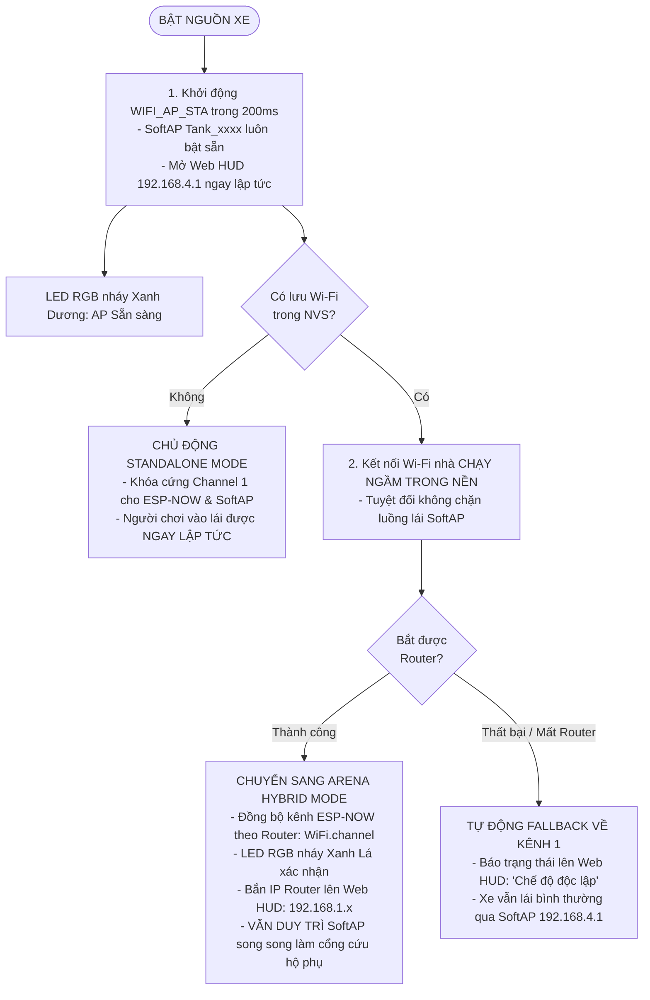

# MICRO TANK ARENA (ESP32-C3 LASER TAG) — BỘ TÀI LIỆU TOÀN DIỆN HỆ THỐNG

## SYSTEM MASTER SPECIFICATION & CROSS-CHECK VERIFICATION (SINGLE SOURCE OF TRUTH v1.1.0)

> **MỤC ĐÍCH TÀI LIỆU**: Đây là bản đặc tả kỹ thuật và tiêu chuẩn nghiệm thu chéo tối thượng của dự án **Micro Tank Arena**. Tài liệu đã được vá toàn bộ 4 lỗi phần cứng cốt lõi (Strapping Pin GPIO 8, Tần số PWM cho N20, Đồng bộ kênh sóng Wi-Fi/ESP-NOW và Nút Reset NVS cứng). Bất kỳ Kỹ sư nhúng hoặc Trợ lý AI (Claude, GPT, Gemini) khi đọc tài liệu này đều có thể khởi tạo dự án chuẩn xác 100% hoặc dùng làm bộ tiêu chí kiểm tra chéo (Cross-check Checklist) với mã nguồn hiện hữu.

---

## 1\. LỜI NHẮC NGỮ CẢNH DÀNH CHO AI (CONTEXT PRIMING PROMPT)

Dự án: "Micro Tank Arena" — Xe tăng chiến đấu mini điều khiển từ xa kết hợp bắn Laser Tag quang học thời gian thực trên nền tảng vi điều khiển ESP32-C3 Super Mini (RISC-V 160MHz).

5 PHÂN HỆ CỐT LÕI & CÁC RÀNG BUỘC PHẦN CỨNG BẮT BUỘC:

1\. ĐỘNG LỰC (MotorDriver): Driver DRV8833 kéo 2 động cơ giảm tốc bánh răng kim loại N20. Tần số PWM BẮT BUỘC đặt ở mức 2kHz (không dùng 20kHz để tránh mất mô-men xoắn ở dải tốc độ thấp). Chân nSLEEP (GPIO 8\) là STRAPPING PIN: bắt buộc có trở kéo lên Pull-up 10kΩ lên 3.3V hoặc kích HIGH ngay lập tức lúc khởi động để không treo bootloader. Tích hợp Slew-Rate Limiter (±20 đơn vị/10ms) chống sụt áp nguồn (Brownout) và Fail-safe ngắt sau 300ms mất tín hiệu.

2\. QUANG HỌC (IrTransceiver & IrProtocol): Bắn IR 940nm qua Transistor 2N2222 (GPIO 4\) điều chế sóng mang 38kHz chuẩn xác bằng ngoại vi RMT phần cứng (Duty Cycle 33%). Nhận đạn qua mắt thu TSOP38238 tích cực LOW (GPIO 5\) với ngắt microsecond giải mã gói tin 16-bit (Team: 4b, Player: 4b, Damage: 4b, Checksum XOR: 4b). Chống phản xạ tường, chống đạn cùng phe (Friendly Fire Rejection).

3\. HIỆU ỨNG PHẢN HỒI (Feedback): 01 LED RGB WS2812B (GPIO 6\) báo màu phe, chớp trắng khi dính đạn, chớp nhanh khi bất tử (I-Frame 100ms), nháy đỏ khi chết. 01 Còi buzzer thụ động (GPIO 7\) tạo âm thanh phi chặn (non-blocking tone).

4\. MÁY TRẠNG THÁI GAME (TankGameEngine): Finite State Machine 5 trạng thái (LOBBY, BATTLE, HIT\_STUN, RELOAD, DEAD). Máu mặc định 5 HP, băng đạn 10 viên, hồi chiêu bắn 800ms, giật lùi (Recoil) 50ms, khựng xe khi trúng đạn 400ms, bất tử (I-Frame) 1500ms, nạp đạn 3500ms, thanh nộ Ulti 0-100% (bắn đại bác 3 DMG).

5\. MẠNG CHỦ ĐỘNG HYBRID ALWAYS-ON & QUẢN TRỊ NVS (TankNetwork): Chế độ `WIFI_AP_STA` khởi động siêu tốc trong 200ms — luôn phát SoftAP "Tank_xxxx" (192.168.4.1) ngay lập tức để người chơi vào lái được ngay không độ trễ. Song song đó, tiến trình kết nối Wi-Fi nhà (Router STA) chạy ngầm trong nền. Nếu kết nối Router thành công, xe tự đồng bộ kênh ESP-NOW theo Router và cập nhật IP nhà lên Web HUD nhưng VẪN DUY TRÌ SoftAP song song làm cổng cứu hộ phụ. Nếu mất mạng hoặc ở sân đấu lạ, xe tự động fallback về Standalone (khóa cứng Channel 1). Quản trị mạng chủ động ngay trên Web HUD (quét Wi-Fi, lưu NVS, nút bấm Quên Wi-Fi trên web), nút BOOT vật lý (GPIO 9 đè 3s) giữ vai trò cứu hộ phần cứng cuối cùng.

---

## 2\. ĐẶC TẢ PHẦN CỨNG & BẢNG GOLDEN PINOUT (ĐÃ SỬA LỖI)

### 2.1 Bảng quy hoạch chân Golden Pinout ESP32-C3 Super Mini

| Chân GPIO | Kiểu chân | Ngoại vi ESP32 | Linh kiện kết nối | Chức năng chi tiết | Ràng buộc kỹ thuật & Xử lý phần cứng |
| :---- | :---- | :---- | :---- | :---- | :---- |
| **GPIO 0** | Output | LEDC Ch 0 | DRV8833 `IN1` | Động cơ Trái: Tiến (PWM 2kHz) | An toàn khi khởi động. |
| **GPIO 1** | Output | LEDC Ch 1 | DRV8833 `IN2` | Động cơ Trái: Lùi (PWM 2kHz) | An toàn khi khởi động. |
| **GPIO 2** | Output | LEDC Ch 2 | DRV8833 `IN3` | Động cơ Phải: Tiến (PWM 2kHz) | **\[STRAPPING PIN\]**: Phải ở mức HIGH lúc boot. Không gắn trở kéo xuống GND. |
| **GPIO 3** | Output | LEDC Ch 3 | DRV8833 `IN4` | Động cơ Phải: Lùi (PWM 2kHz) | An toàn khi khởi động. |
| **GPIO 4** | Output | RMT TX Ch 0 | Cực B Transistor 2N2222 | Bắn xung IR 38kHz (Duty 33%) | RMT phần cứng xuất xung chuẩn nanosecond, nòng ống gom tia 10° \- 15°. |
| **GPIO 5** | Input | GPIO ISR | Chân OUT TSOP38238 | Nhận đạn hồng ngoại 38kHz | Mắt thu tích cực mức LOW, kích hoạt ngắt `CHANGE` đo microsecond. |
| **GPIO 6** | Output | Digital OUT | Data In (DIN) WS2812B | LED RGB hiển thị phe & hiệu ứng | Chuẩn timing 800kHz của NeoPixel. |
| **GPIO 7** | Output | LEDC PWM (CH4) | Chân (+) Loa mini 8Ω / Buzzer thụ động | Âm thanh thiết giáp cơ học thực tế | Điều chế xung LEDC PWM kênh 4 phi chặn ($15\text{Hz} - 850\text{Hz}$). |
| **GPIO 8** | Output | Digital OUT | DRV8833 `nSLEEP` | Bật/tắt công suất động cơ | **\[STRAPPING PIN\]**: Bắt buộc mức HIGH lúc boot. Phải gắn trở Pull-up 10kΩ lên 3.3V và kích HIGH ngay đầu hàm `setup()`. |
| **GPIO 9** | Input | GPIO Pull-up | Nút nhấn BOOT vật lý | Nạp code / Hard Reset NVS | **Cứu hộ phần cứng**: Nhấn giữ 3 giây khi bật nguồn để xóa trắng cấu hình Wi-Fi NVS. |
| **GPIO 18** | D- | USB-JTAG | Chân USB D- | Nạp code & Serial CDC | Cấu hình `-DARDUINO_USB_CDC_ON_BOOT=1`. |
| **GPIO 19** | D+ | USB-JTAG | Chân USB D+ | Nạp code & Serial CDC | Cấu hình `-DARDUINO_USB_CDC_ON_BOOT=1`. |

---

## 3\. GIAO THỨC TRUYỀN THÔNG & ĐẶC TẢ GÓI TIN

### 3.1 Khung đạn quang học IR 16-bit

- **Sóng mang:** 38kHz, điều chế RMT phần cứng (Carrier Duty Cycle 33%).  
- **Cấu trúc gói tin 16-bit:**  
    
  \[4-bit Team ID\] \[4-bit Player ID\] \[4-bit Damage\] \[4-bit Checksum\]  
    
- **Công thức Checksum:** \$\$\\text{Checksum} \= (\\text{Team ID} \\oplus \\text{Player ID} \\oplus \\text{Damage}) \\ & \\ 0x0F\$\$  
- **Cơ chế lọc an toàn:** Bỏ qua gói tin nếu Checksum sai, hoặc nếu `Team ID == My Team ID` (chống bắn bồ), hoặc khi đang trong khung bất tử `isIFrame == true` (1.5s).

### 3.2 Giao thức WebSocket điều khiển (Web Client ↔ Xe)

Giao tiếp thời gian thực định dạng JSON qua endpoint `/ws`:

- **Web Client → Xe (Tần số 20Hz \- mỗi 50ms):**  
  - Lái xe: `{"type": "drive", "left": 180, "right": -180}` (dải giá trị: \-255 đến \+255).  
  - Bắn thường: `{"type": "fire"}`.  
  - Nạp đạn: `{"type": "reload"}`.  
  - Bắn chiêu cuối: `{"type": "ulti"}` (yêu cầu Ulti đạt 100%, gây 3 DMG).  
  - Quản lý mạng: `{"type": "scan_wifi"}`, `{"type": "save_wifi", "ssid": "...", "pass": "..."}`, `{"type": "reset_wifi"}`.  
- **Xe → Web Client (Định kỳ 100ms hoặc khi có sự kiện):**  
  - Trạng thái HUD: `{"type": "hud", "hp": 4, "maxHp": 5, "ammo": 8, "maxAmmo": 10, "ulti": 65, "isIFrame": false, "isDead": false, "state": "BATTLE"}`.  
  - Trạng thái mạng Hybrid: `{"type": "net_status", "mode": "arena" | "standalone", "ip": "192.168.1.50", "ap_ip": "192.168.4.1", "channel": 1}`.  
  - Danh sách mạng quét được: `{"type": "wifi_list", "networks": ["WiFi_Nha", "Arena_Zone1"]}`.
  - Phản hồi lưu / quên mạng: `{"type": "wifi_status", "status": "saved" | "cleared", "msg": "..."}`.

### 3.3 Kiến trúc mạng chủ động "Hybrid Always-On" & Đồng bộ kênh sóng vô tuyến

- **Sẵn sàng tức thì (Zero-Wait Time):** Khởi động `WIFI_AP_STA` trong 200ms, không có thời gian chờ 6s kết nối thử. Điện thoại bật Wi-Fi là thấy xe ngay.
- **Truy cập song song (Dual-Access):** Người chơi có thể lái xe qua cổng SoftAP trực tiếp (`192.168.4.1`) hoặc qua IP mạng nhà (`192.168.1.x` / `tank.local`). Nếu mDNS bị lỗi trên điện thoại Android, SoftAP luôn sẵn sàng làm kênh dự phòng không thể bị ngắt.
- **Quản trị mềm trên Web UI:** Hỗ trợ lệnh `reset_wifi` từ Web WebSocket để quên mạng ngay trên buồng lái mà không cần lật xe bấm nút phần cứng. Nút cứng BOOT (GPIO 9 đè 3s) chỉ kích hoạt khi firmware bị lỗi nặng.
- **Auto-Recovery khi mất Router:** Nếu Router nhà bị ngắt điện hoặc xe chạy ra khỏi tầm phủ sóng, sau 2 giây xe tự động trả kênh ESP-NOW về Channel 1 để duy trì kết nối mạng cục bộ giữa các xe.

---

## 4\. TIÊU CHÍ KIỂM TRA CHÉO (CROSS-CHECK VERIFICATION CHECKLIST - ĐÃ NGHIỆM THU)

### Nhóm 1: Kiểm tra an toàn phần cứng & Strapping Pin
- [x] **Chân GPIO 8 (nSLEEP):** Mạch có lắp điện trở kéo lên 10kΩ lên 3.3V. Trong hàm `setup()` và `MotorDriver::begin()`, lệnh `pinMode(PIN_NSLEEP, OUTPUT); digitalWrite(PIN_NSLEEP, HIGH);` được gọi ngay dòng đầu tiên để chống treo boot.  
- [x] **Chân GPIO 2:** Tuyệt đối không nối trở kéo xuống GND (Pull-down).  
- [x] **Nút cứu hộ phần cứng:** Chân GPIO 9 có hàm kiểm tra `digitalRead(9) == LOW` giữ trong 3 giây khi boot để chạy `prefs.clear()` và `ESP.restart()`.

### Nhóm 2: Kiểm tra cấu hình động cơ & Chống sụt áp (Brownout)
- [x] **Tần số PWM:** Trong file `MotorDriver.h`, hằng số `PWM_FREQ` đặt ở mức chuẩn **2000Hz (2kHz)** tối ưu mô-men xoắn cho động cơ N20.  
- [x] **Slew-Rate Limiter:** Hàm cập nhật tốc độ động cơ tích hợp thuật toán chặn gia tốc ±20 PWM mỗi chu kỳ 10ms.  
- [x] **Fail-safe ngắt động cơ:** Sau 300ms không nhận được gói tin `drive`, xe tự động dừng bánh hoàn toàn.

### Nhóm 3: Kiểm tra hệ thống quang học Laser Tag
- [x] **Điều chế RMT 38kHz:** Bộ phát IR sử dụng ngoại vi phần cứng RMT với Duty Cycle 33% chuẩn nanosecond.  
- [x] **Khung truyền 16-bit:** Gói tin đủ 4 trường: Team ID, Player ID, Damage, Checksum.  
- [x] **Thuật toán Checksum:** Công thức kiểm tra đúng chuẩn: `(team ^ player ^ damage) & 0x0F`.  
- [x] **Loại trừ đồng đội:** Có dòng kiểm tra `if (pkt.teamId == myTeamId) return;` trước khi trừ máu.

### Nhóm 4: Kiểm tra cơ chế game FSM
- [x] **Thời gian khựng (Hit-Stun):** Xe khóa động cơ trong 400ms ngay khi trúng đạn.  
- [x] **Khung bất tử (I-Frame):** Xe bỏ qua tín hiệu đạn và nhấp nháy đèn LED RGB trong 1500ms sau khi bị bắn.  
- [x] **Nạp đạn (Reload):** Xe khóa nút bắn trong 3500ms khi hết 10 viên đạn.  
- [x] **Độ giật (Recoil):** Có xung lùi xe ngược hướng 50ms khi khai hỏa.

### Nhóm 5: Kiểm tra kiến trúc mạng chủ động Hybrid Always-On & Kênh sóng
- [x] **Khởi động tức thì (Zero-Wait AP):** Hàm khởi tạo mạng bật ngay `WiFi.mode(WIFI_AP_STA)` và phát `WiFi.softAP()` trong vòng 200ms đầu tiên, không bị chặn delay bởi tiến trình kết nối STA.  
- [x] **Tiến trình STA chạy ngầm:** Việc kết nối vào Router nhà được thực hiện ngầm phi chặn (non-blocking) trong hàm `update()`.  
- [x] **Đồng bộ kênh ESP-NOW:** Khi kết nối vào Wi-Fi nhà thành công, code tự động lấy kênh của Router (`WiFi.channel()`) để thiết lập lại kênh cho ESP-NOW qua `esp_wifi_set_channel()`.  
- [x] **Cố định kênh SoftAP & Auto-Recovery:** Khi mất kết nối Router quá 2 giây (hoặc ở Standalone Mode), xe tự động trả kênh sóng ESP-NOW về cố định **Channel 1**.  
- [x] **Quản trị mạng mềm trên Web:** Handler WebSocket xử lý gói tin `reset_wifi` để xóa cấu hình NVS ngay từ Web UI mà không bắt buộc đè nút bấm vật lý.  

### Nhóm 6: Kiểm tra buồng lái Web HUD & UX
- [x] **Loại bỏ độ trễ cảm ứng:** Mã nguồn HTML buồng lái sử dụng `ontouchstart` / `ontouchend` kèm thuộc tính CSS `touch-action: none; user-select: none;`.  
- [x] **Âm thanh phi tải (Synthesizer):** Hệ thống âm thanh trên Web chạy bằng `Web Audio API` độc lập, không phụ thuộc vào tải file MP3 bên ngoài.  
- [x] **Phân phối dự phòng kép:** File Web HUD được nhúng trực tiếp dạng chuỗi `PROGMEM` trong header C++ (`WebDashboard.h`) đồng thời đồng bộ nguyên vẹn trong LittleFS (`data/index.html`).  
- [x] **Huy hiệu mạng thời gian thực & Quản trị nhanh:** Giao diện tích hợp huy hiệu mạng `#net-badge` (đổi màu xanh Cyan/Green theo chế độ), nút Quên Wi-Fi nhanh 🚫 trên Top HUD, thẻ Live Network Card trong Cài đặt và JavaScript xử lý gói tin `net_status` cập nhật tức thì.

### Nhóm 7: Kiểm tra chế độ đấu đội (Squad Battle), Danh sách xe (Roster) & Tùy chỉnh màu/tên xe
- [x] **Beacon định danh qua ESP-NOW Mesh:** Định kỳ mỗi 1000ms, mỗi xe phát một gói tin `EspNowBeaconMsg` (Type `0x02`, Team ID, Player ID, HP, MaxHP, State, Callsign) quảng bá broadcast trên kênh Wi-Fi hiện hành.
- [x] **Theo dõi đồng đội & đối thủ phi tập trung:** Xe lưu trữ mảng `PeerInfo _peers[12]`, tự động làm sạch (prune) các xe mất tín hiệu quá 4000ms.
- [x] **Hiển thị thanh máu đồng đội & quân số trên Web:** Giao diện Web hiển thị bảng `SQUAD BATTLE NET` thời gian thực với thanh máu dạng vạch mini của từng xe đồng đội (Cyan) và đối thủ (Crimson), cùng tỷ số quân số hai đội (`🔵 Blue vs 🔴 Red`).
- [x] **Lobby tùy chỉnh xe & Đổi màu LED tức thì:** Modal phòng đấu cho phép nhập Tên xe (Callsign), chọn Số hiệu (Player ID 1-15), chọn Đội (Team Blue / Team Red). Khi lưu, lệnh WebSocket `set_profile` đổi màu đèn LED NeoPixel WS2812B trên xe (GPIO 6) ngay lập tức và lưu vào NVS `tank_prof` an toàn.

---

## 5\. BẢNG MÃ LỖI THƯỜNG GẶP & BIỆN PHÁP KHẮC PHỤC CẤP TỐC

| Triệu chứng lỗi | Nguyên nhân gốc rễ | Cách xử lý cấp tốc trong mã nguồn / mạch |
| :---- | :---- | :---- |
| **ESP32-C3 treo không boot, Serial im lặng** | GPIO 8 hoặc GPIO 2 bị kéo tụt xuống mức LOW lúc cấp nguồn | Thêm trở kéo lên 10kΩ lên 3.3V cho GPIO 8; kiểm tra xem chân GPIO 2 có bị chạm mass không. |
| **Xe khởi động lại liên tục khi bấm ga** | Sụt áp nguồn (Brownout Reset) do động cơ ăn dòng đỉnh | Giảm `SLEW_STEP` trong `MotorDriver.h` xuống 15; hàn thêm tụ hóa 470µF \- 1000µF sát chân nguồn DRV8833. |
| **Động cơ rít the thé nhưng không quay khi bò chậm** | Đang đặt tần số PWM quá cao (20kHz) | Đổi `PWM_FREQ` trong `MotorDriver.h` thành `2000` (2kHz). |
| **Nhập sai Wi-Fi khiến xe không thể mở Web cấu hình lại** | Xe cố kết nối mạng cũ thất bại nhưng thiếu cơ chế cứu hộ | Nhờ SoftAP luôn bật song song, truy cập ngay `192.168.4.1` rồi bấm "Quên Wi-Fi" trên Web HUD; nếu firmware bị treo, giữ nút `BOOT` (GPIO 9\) trong 3 giây lúc bật nguồn. |
| **Xe không nhận đạn dù bắn ở cự ly gần** | Góc nòng súng quá lệch hoặc cảm biến TSOP bị nhiễu nguồn | Nối tụ gốm 100nF giữa chân VCC và GND của TSOP; kiểm tra điện trở cực B transistor 2N2222 (1kΩ). |
| **Ở nhà chơi được nhưng mang sang nhà bạn bè ESP-NOW tịt** | Router nhà bạn bè chạy kênh khác kênh của xe phát | Kiểm tra lại logic đồng bộ kênh: gọi `esp_wifi_set_channel(WiFi.channel(), WIFI_SECOND_CHAN_NONE)` sau khi kết nối Wi-Fi. |

